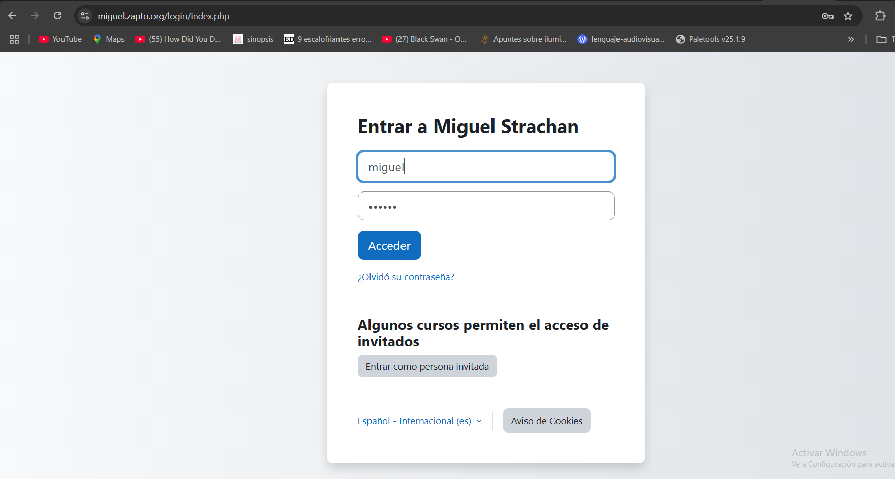
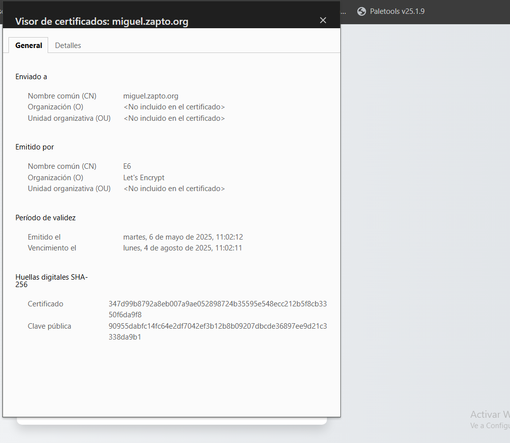
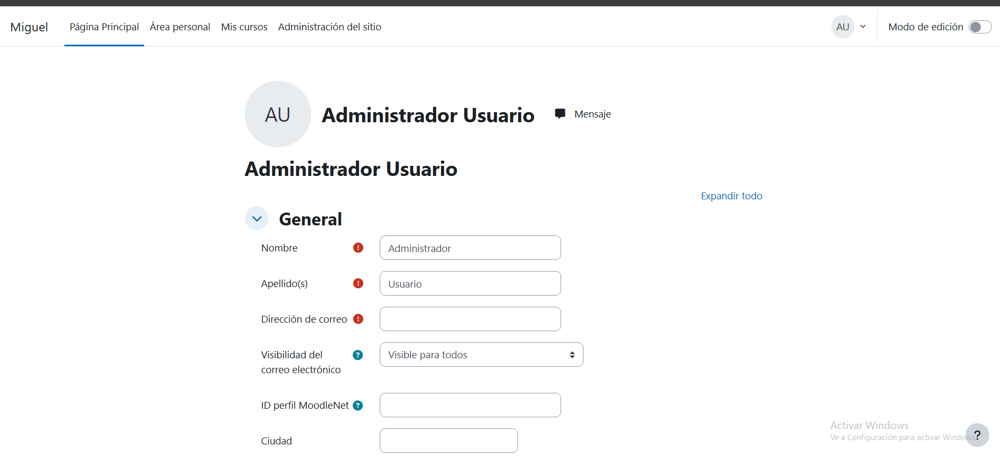

# practica-1.8

En esta práctica vamos a ralizar la instalación de moodle.Para su correxta instlación vamos a necesitar de unos cuantos scripts como en la practicas anteriores.Install-lamp,let-scrypt y deploy de moodle.
Como siempre tendremos un archivo .env donde almacenaremos las variables.
en el archivo htaccess tendremos la siguiente informacion "Require all denied".
Como es de imaginar, usaremos nuestro dominio para acceder via https al moodle.

Empezamos con la instalación:
## Instalacion de LAMP

Primero instalaremos apache a traves de la pila lamp.

Primero ponemos el comando para ver cada comando y finalizar si hay error.
```bash
set -ex
```

Actualizamos repositorios y paquetes.
```bash
apt update
apt upgrade -y
```

Instalamos apache y habilitamos el modulo de reescritura.
```bash
apt install apache2 -y
a2enmod rewrite
```

Copiamos el archivo de conf en sitios disponibles.
```bash
cp ../conf/000-default.conf /etc/apache2/sites-available
```
Instalamos PHP.
```bash
apt install php libapache2-mod-php php-mysql -y
```
Reiniciamos apache.
```bash
systemctl restart apache2
```
Ahora instalamos MySQL
```bash
apt install mysql-server -y
```

Cambiamos el propietario
```bash
chown -R www-data:www-data /var/www/html
```

## Ahora,instalamos el certificado,para el redireccionamiento https.

Configuramos para mostrar los comandos y finalizar si hay error
```bash
set -ex
```
Importamos el archivo de variables
```bash
source .env
```
El proveedor de donimnio sera no-ip

Instalamos y actualizamos snap
```bash
snap install core
snap refresh core
```
Eliminamos instalaciones previas de cerbot con apt

```bash
apt remove certbot -y
```
Instalamos Certbot
```bash
snap install --classic certbot
```
Solicitamos un cerficado a Let`s Encrypt.

```bash
sudo certbot --apache -m $LE_EMAIL --agree-tos --no-eff-email -d $LE_DOMAIN --non-interactive
```

## Instlación de moodle

Primero crearemos una base de datos para guardar informacion de moodle

```bash
mysql -u root <<< "DROP DATABASE IF EXISTS $moodle_DB_NAME"
mysql -u root <<< "CREATE DATABASE $moodle_DB_NAME"
mysql -u root <<< "DROP USER IF EXISTS $moodle_DB_USER@$IP_CLIENTE_MYSQL"
mysql -u root <<< "CREATE USER $moodle_DB_USER@$IP_CLIENTE_MYSQL IDENTIFIED BY '$moodle_DB_PASSWORD'"
mysql -u root <<< "GRANT ALL PRIVILEGES ON $moodle_DB_NAME.* TO $moodle_DB_USER@$IP_CLIENTE_MYSQL"
```

Eliminamos el moodle antiguo para habilitar la reutilizacion del script

```bash
rm -rf moodle
```
Clonamos el repositorio del moodle a nuestra maquina ubuntu
```bash
git clone -b MOODLE_405_STABLE git://git.moodle.org/moodle.git
```

#Quitamos lo que hay en html

```bash
rm -rf /var/www/html/*
```

Movemos el contenido de moodle a la carpeta de html

```bash
mv moodle/* /var/www/html/
```

#Borramos la carpeta moodle de la carpeta scripts

```bash
rm -rf moodle
```

#Ponemos permisos de root a la carpeta de moodle

```bash
chown -R root /var/www/html/
chmod -R 0755 /var/www/html/
```

#Borramos la carpeta antigua

```bash
rm -rf /var/www/moodledata
```

#Creamos una carpeta moodledata

```bash
mkdir /var/www/moodledata
```

Le ponemos permisos

```bash
chown -R www-data:www-data /var/www/moodledata
```

#Movemos el htaccess a la carpeta de moodledata

```bash
cp ../htaccess/.htaccess /var/www/moodledata/
```

#Cambiamos el numero maximo de variables permitidas a 5000

```bash
sed -i "s/;max_input_vars = 1000/max_input_vars = 5000/" /etc/php/8.3/cli/php.ini
```

configurado todos los parametros para instalar en automatico el moodle utilizando el WP-CLI
```bash
php $moodle_DIRECTORY/admin/cli/install.php \
    --wwwroot="https://$LE_DOMAIN" \
    --dataroot=/var/www/moodledata \
    --dbname=$moodle_DB_NAME \
    --dbuser=$moodle_DB_USER \
    --dbpass=$moodle_DB_PASSWORD \
    --dbhost=$IP_CLIENTE_MYSQL \
    --fullname="$FullName" \
    --shortname=$ShorName \
    --adminuser=$AdminUser \
    --adminpass=$AdminPass \
    --non-interactive \
    --agree-license \
    --lang=es
```

Cambiamos los permisos  para que los demas puedan ver la pagina

```bash
chmod -R 755 /var/www/html
 ```
Reiniciamos el apache para aplicar todos los ajustes
```bash
systemctl restart apache2
```
## Comprobaciones.
Acceso a moodle via nuestro dominio




Comprobamos el certificado.




Comprobación de que podemos acceder con mi usuario.

